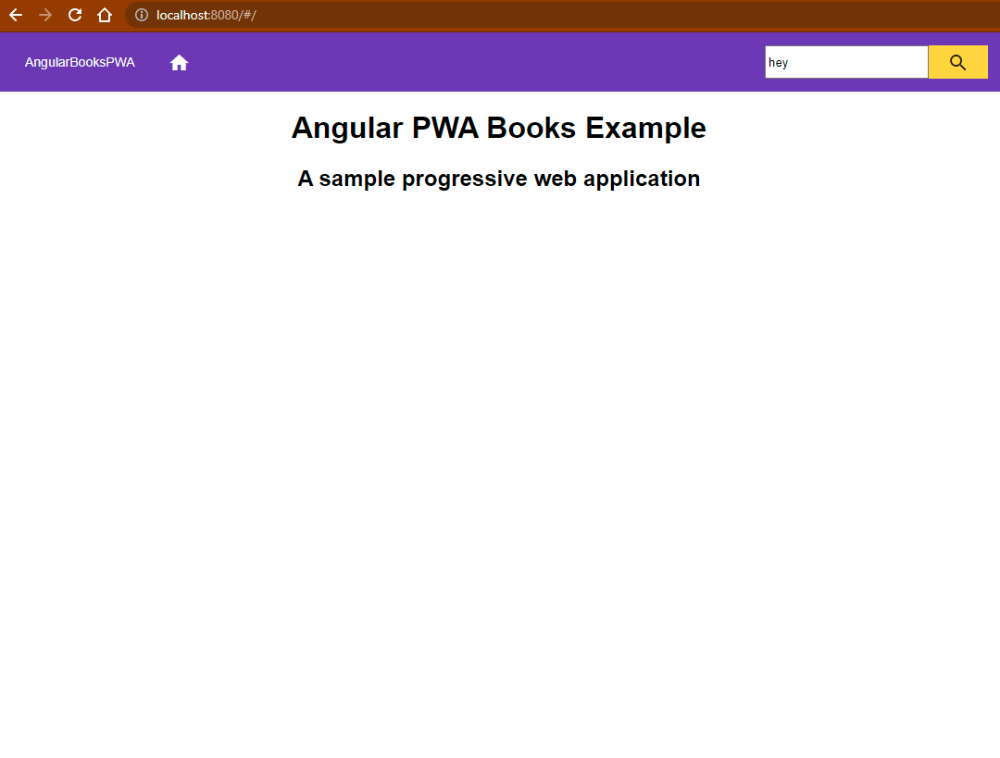
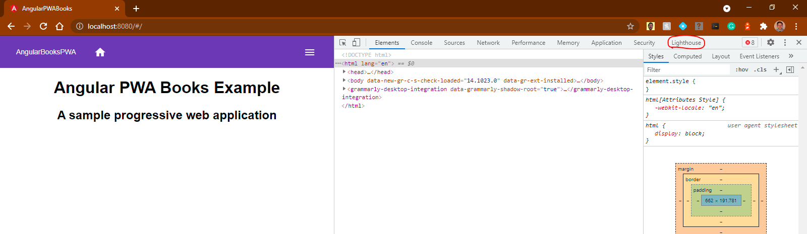
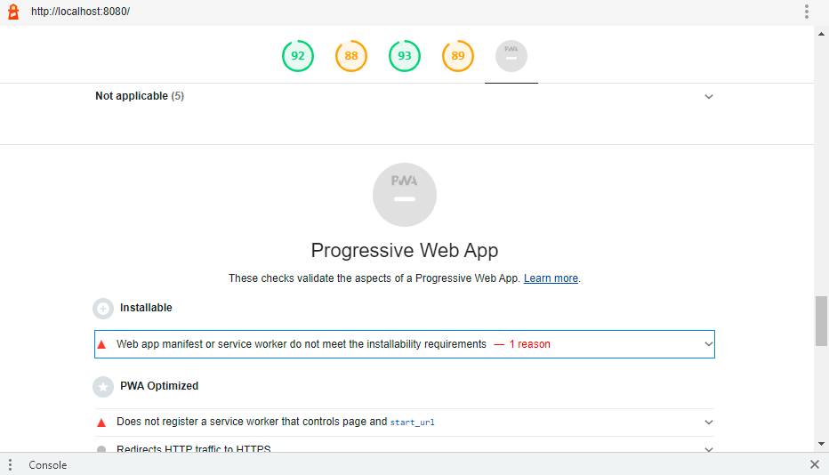
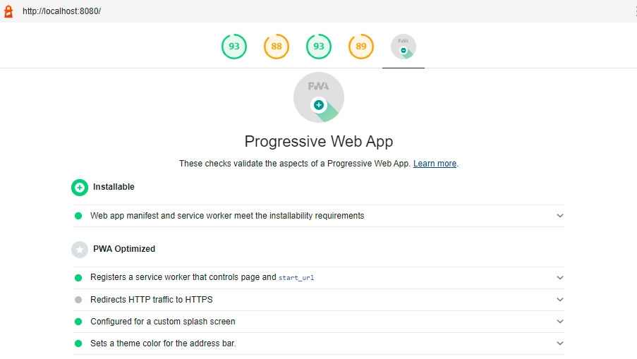

# Build your first PWA with Angular and OKTA services

by Andrew Walkowski


## Welcome
One of the hottest trends in web development right now is the practice of Progressive web applications (PWA). Browser requests are handled by a javascript file known as the service worker. This service worker works to get the most recent updates of resources and caches the resources in the browser session so that way the application can operate normally online or offline. 

**NOTE:** This post follows a previous tutorial from Holger Schmitz Use Angular to build your first PWA. Holger’s 2019 tutorial is a good tutorial but is outdated when it comes to OKTA authentication, and angular PWA features. I ran into a lot of bugs running working through the tutorial which probably stems from the tutorial being almost being 3 years old at this time. This tutorial is in many ways a duplicate to Holger’s previous tutorial with modifications to work with more current updates.

## Install Node
Visit this link: https://nodejs.org/en/download/ to download Node.js for your respective os. Download the installer from your browser and follow the instructions. 

## Create a single page application
After node is installed get started on creating the single page application by first installing the angular command line tool. Open a shell and run 
```
npm install -g @angular/cli@latests
```
you may need to run this command with sudo, but this will install the ng command on your OS. Once finished you can create your application 
```
ng new [NameOfDirectory]
```
replace NameOfDirectory with the name of the directory you want to hold the angular application. You will be asked two questions:
* “Would you like to add Angular routing?” reply Yes. 
*  “which stylesheet format would you like to use?” select CSS for that.

# Add angular material and flex layout

Navigate into the newly made project directory and run the following command
```
Ng add @angular/material
```

* Pick the deep purple/amber theme
* Do NOT set up global angular material typography styles?
* Respond yes to setting up browser animations for angular material

  Also run the following for flex layout
  ```
  npm install @angular/flex-layout@latest
  ```
  
Create a file in src/app called `material.module.ts` and the following code:
```
import { NgModule } from '@angular/core';
import { MatTableModule } from '@angular/material/table';
import { MatMenuModule} from '@angular/material/menu';
import { MatIconModule} from '@angular/material/icon';
import { MatCardModule} from '@angular/material/card';
import { MatButtonModule} from '@angular/material/button';
import { MatDividerModule} from '@angular/material/divider';
import { MatProgressSpinnerModule} from '@angular/material/progress-spinner';
import{  MatToolbarModule} from '@angular/material/toolbar';

@NgModule({
    imports: [
        MatToolbarModule,
         MatMenuModule,
         MatIconModule,
         MatCardModule,
         MatButtonModule,
         MatTableModule,
         MatDividerModule,
         MatProgressSpinnerModule 
    ],
    exports: [
        MatToolbarModule,
        MatMenuModule,
        MatIconModule,
        MatCardModule,
        MatButtonModule,
        MatTableModule,
        MatDividerModule,
        MatProgressSpinnerModule 
    ]
})

export class MaterialModule { }

```
Now move to `src/app/app.module.ts` open this file and change it to match the following:
```
import { BrowserModule } from '@angular/platform-browser';
import { NgModule } from '@angular/core';
import { HttpClientModule } from '@angular/common/http';
import { FormsModule, ReactiveFormsModule } from '@angular/forms';
import { FlexLayoutModule } from "@angular/flex-layout";
import { AppRoutingModule } from './app-routing.module';
import { AppComponent } from './app.component';
import { MaterialModule } from './material.module';
import { BrowserAnimationsModule } from '@angular/platform-browser/animations';

@NgModule({
  declarations: [
    AppComponent,
  ],
  imports: [
    BrowserModule,
    HttpClientModule,
    BrowserAnimationsModule,
    FlexLayoutModule,
    FormsModule,
    ReactiveFormsModule,
    MaterialModule,
    AppRoutingModule
  ],
  providers: [],
  bootstrap: [AppComponent]
})
export class AppModule { }
```

The html template should also be changed. Navigate to `src/app/app.component.html` and replace the existing code with the following:
```

<mat-toolbar color="primary" class="expanded-toolbar">
    <span>
      <button mat-button routerLink="/">{{title}}</button>
      <button mat-button routerLink="/"><mat-icon>home</mat-icon></button>
    </span>
    <div fxLayout="row" fxShow="false" fxShow.gt-sm>
        <form [formGroup]="searchForm" (ngSubmit)="onSearch()">
          <div class="input-group">
            <input class="input-group-field" type="search" value="" placeholder="Search" formControlName="search">
            <div class="input-group-button"><button mat-flat-button color="accent"><mat-icon>search</mat-icon></button></div>
          </div>
        </form>
    </div>
    <button mat-button [mat-menu-trigger-for]="menu" fxHide="false" fxHide.gt-sm>
     <mat-icon>menu</mat-icon>
    </button>
</mat-toolbar>
<mat-menu x-position="before" #menu="matMenu">
    <button mat-menu-item routerLink="/"><mat-icon>home</mat-icon> Home</button>

    <form [formGroup]="searchForm" (ngSubmit)="onSearch()">
      <div class="input-group">
        <input class="input-group-field" type="search" value="" placeholder="Search" formControlName="search">
        <div class="input-group-button"><button mat-button routerLink="/"><mat-icon>magnify</mat-icon></button></div>
      </div>
    </form>
</mat-menu>
<router-outlet></router-outlet>
```
Next change `src/style.css` to the contain the following:
```
@import "~@angular/material/prebuilt-themes/deeppurple-amber.css";

body {
  margin: 0;
  font-family: sans-serif;
}

h1, h2 {
  text-align: center;
}

.input-group {
  display: flex;
  align-items: stretch;
}

.input-group-field {
  margin-right: 0;
}

.input-group .input-group-button {
  margin-left: 0;
  border: none;
}

.input-group .mat-flat-button {
  border-radius: 0;
}
```

Next add the following to `src/app/app.component.css`:
```
.expanded-toolbar {
  justify-content: space-between;
  align-items: center;
}
```
Now navigate to the tsconfig.json file and the following code to the compilerOptions section
```
"strictPropertyInitialization": false,
"noImplicitAny": false
```
This way when you add future components and code the code isnt littered with useless error messages.

## Add Search Feature with angular
Now you can implement the main functionality of this sample application. Navigate to `src/app/app.component.ts` change the file to show as follows:
```
import { Component } from '@angular/core';
import { FormGroup, FormBuilder, Validators } from '@angular/forms';
import { Router } from "@angular/router";

import { BooksService } from './books/books.service';

@Component({
  selector: 'app-root',
  templateUrl: './app.component.html',
  styleUrls: ['./app.component.css']
})
export class AppComponent {
  title = 'AngularLibraryPWA';
  searchForm: FormGroup;

  constructor(private formBuilder: FormBuilder,
    private router: Router) {
  }

  ngOnInit() {
    this.searchForm = this.formBuilder.group({
      search: ['', Validators.required],
    });
    
  }

  onSearch() {
    if (!this.searchForm.valid) return;
    this.router.navigate(['search'], { queryParams: {query: this.searchForm.get('search')?.value}});
  }
}
```
Copying and pasting this code into the `app.component.ts` file will result in an error until you create the book service in the next step.

Create a service to talk to the sample function API
Next you will create a book service that will act as an interface fo the OpenLibrary API this sample application. This is a good example for implementing API’s into your PWA. First run this command in the application directory
```
ng generate service books/books
```
this creates a folder in src/app called books that has two files. Open `books.service.ts` and replace its contents with:
```
import { Injectable } from '@angular/core';
import { HttpClient, HttpParams } from '@angular/common/http';

const baseUrl = 'http://openlibrary.org';

@Injectable({
  providedIn: 'root'
})
export class BooksService {

  constructor(private http: HttpClient) { }

  async get(route: string, data?: any) {
    const url = baseUrl+route;
    let params = new HttpParams();

    if (data!==undefined) {
      Object.getOwnPropertyNames(data).forEach(key => {
        params = params.set(key, data[key]);
      });
    }

    const result = this.http.get(url, {
      responseType: 'json',
      params: params
    });

    return new Promise<any>((resolve, reject) => {
      result.subscribe(resolve as any, reject as any);
    });
  }

  searchBooks(query: string) {
    return this.get('/search.json', {title: query});
  }
}
```
Generate other components for PWA with angular cli
Now you will make the components that utilize the search function; Home, details, and search lists. Make them using the following commands in your application directory
```
ng g c home –-module=app
ng g c search –-module=app
ng g c details –-module=app
```
After creating these you will have to link them to routes using the routing module. Navigate to `src/app/app-routing.module.ts` and add the following:
```
import { NgModule } from '@angular/core';
import { Routes, RouterModule } from '@angular/router';
import { HomeComponent } from './home/home.component';
import { SearchComponent } from './search/search.component';
import { DetailsComponent } from './details/details.component';

const routes: Routes = [
  { path: '', component: HomeComponent },
  { path: 'search', component: SearchComponent },
  { path: 'details', component: DetailsComponent },
];

@NgModule({
  imports: [RouterModule.forRoot(routes , { useHash: true })],
  exports: [RouterModule]
})
export class AppRoutingModule { }
```
Go to the home component html file at src/app/home/home.component.html
and add the following:
```
<h1>Angular Library PWA</h1>
<h2>A simple progressive web application</h2>
```
Next add the search component by navigating to the `src/app/search/search.component.ts` and replacing it’s code with:
```
import { Component, OnInit } from '@angular/core';
import { ActivatedRoute, Router } from '@angular/router';
import { MatTableDataSource } from '@angular/material/table';
import { BooksService } from '../books/books.service';
import { Subscription } from 'rxjs';

@Component({
  selector: 'app-search',
  templateUrl: './search.component.html',
  styleUrls: ['./search.component.css']
})
export class SearchComponent implements OnInit {
  private subscription: Subscription;

  displayedColumns: string[] = ['title', 'author', 'publication', 'details'];
  books = new MatTableDataSource<any>();

  constructor(private route: ActivatedRoute,
              private router: Router,
              private bookService: BooksService) { }

  ngOnInit() {
    this.subscription = this.route.queryParams.subscribe(params => {
      this.searchBooks(params['query']);
    });
  }

  ngOnDestroy() {
    this.subscription.unsubscribe();
  }

  async searchBooks(query: string) {
    const results = await this.bookService.searchBooks(query);

    this.books.data = results.docs;
  }

  viewDetails(book) {
    console.log(book);
    this.router.navigate(['details'], { queryParams: {
      title: book.title,
      authors: book.author_name && book.author_name.join(', '),
      year: book.first_publish_year,
      cover_id: book.cover_edition_key
    }});
  }
}
```
Naviagte to `src/app/search/search.component.html` and updates its code to:
```
<h1 class="h1">Search Results</h1>
<div fxLayout="row" fxLayout.xs="column" fxLayoutAlign="center" class="products">
  <table mat-table fxFlex="100%" fxFlex.gt-sm="66%" [dataSource]="books" class="mat-elevation-z1">
    <ng-container matColumnDef="title">
      <th mat-header-cell *matHeaderCellDef>Title</th>
      <td mat-cell *matCellDef="let book"> {{book.title}} </td>
    </ng-container>
    <ng-container matColumnDef="author">
      <th mat-header-cell *matHeaderCellDef>Author</th>
      <td mat-cell *matCellDef="let book"> {{book.author_name && book.author_name.join(', ')}} </td>
    </ng-container>
    <ng-container matColumnDef="publication">
      <th mat-header-cell *matHeaderCellDef>Pub. Year</th>
      <td mat-cell *matCellDef="let book"> {{book.first_publish_year}} </td>
    </ng-container>
    <ng-container matColumnDef="details">
      <th mat-header-cell *matHeaderCellDef></th>
      <td mat-cell *matCellDef="let book">
        <button mat-icon-button (click)="viewDetails(book)"><mat-icon>visibility</mat-icon></button>
      </td>
    </ng-container>
    <tr mat-header-row *matHeaderRowDef="displayedColumns"></tr>
    <tr mat-row *matRowDef="let row; columns: displayedColumns;"></tr>
  </table>
</div>
```
Now do the details component. Open `src/app/details/details.component.ts` and replace code with:
```
import { Component, OnInit } from '@angular/core';
import { ActivatedRoute } from '@angular/router';
import { Subscription } from 'rxjs';

@Component({
  selector: 'app-details',
  templateUrl: './details.component.html',
  styleUrls: ['./details.component.css']
})
export class DetailsComponent implements OnInit {
  private subscription: Subscription;
  book: any;

  constructor(private route: ActivatedRoute) { }

  ngOnInit() {
    this.subscription = this.route.queryParams.subscribe(params => {
      this.updateDetails(params);
    });
  }

  ngOnDestroy() {
    this.subscription.unsubscribe();
  }

  updateDetails(book) {
    this.book = book;
  }
}
```
Next Navigate to `src/app/details.component.html` and replace that code with:
```
<h1 class="h1">Book Details</h1>
<div fxLayout="row" fxLayout.xs="column" fxLayoutAlign="center" class="products">
  <mat-card fxFlex="100%" fxFlex.gt-sm="66%" class="mat-elevation-z1">
    <h3>{{book.title}}</h3>
    
    <h4>Authors</h4>
    <p>
      {{book.authors}}
    </p>
    <h4>Published</h4>
    <p>
      {{book.year}}
    </p>
  </mat-card>
</div>
```

# Run the PWA
The foundation of this application is now complete. If you are building this in a repo this would be a good place to commit changes. Now you will run the application to see what you have made so far. Run the following commands to serve and view the application:
```
npm install -g http-server-spa@1.3.0
ng build --prod --source-map
http-server-spa dist/[NameOfDirectory] / index.html 8080
```
Navigate to http://localhost:8080
Here are some screenshots of what it should look like:
Home:


If you are in chrome and right click on the home component you will see the Chrome dev tools appear to the side of screen like so:



Select the red circled tab labeled “Lighthouse” Then click “generate report”. It may take a few seconds, but you should get something resembling a report on Performance, Accessibility, Best Practices, SEO, and Progressive Web App. You will see PWA is greyed out because there is no service worker for the application yet.



This problem has an easy solution since Angular has built in pwa functions that build service workers for you. Just run the following command in your application directory:
```
Ng add @angular/pwa
```
Once again build and serve the application and visit http://localhost:8080 when you generate a lighthouse report. You will see the PWA circle now has a green circle in notifying you that you now have a Progressive Web Application


## Caching recent responses

Now you have a PWA, but offline functionality is still very weak. Search a random book and go to the details page of that book. Once there go to the development tools> Network tab > select offline. Now when you try to click the back button the search results will not appear. You wil fix this by implementing a request cahce. Start by running these two commands in the command line:
```
ng generate service cache/request-cache
ng generate service cache/caching-interceptor
```
Move to `src/app/cache/request-cache.service.ts` and change the file to:
```
import { Injectable } from '@angular/core';
import { HttpRequest, HttpResponse } from '@angular/common/http';

const maxAge = 30000;
@Injectable({
  providedIn: 'root'
})
export class RequestCache  {

  cache = new Map();

  get(req: HttpRequest<any>): HttpResponse<any> | undefined {
    const url = req.urlWithParams;
    const cached = this.cache.get(url);

    if (!cached) return undefined;

    const isExpired = cached.lastRead < (Date.now() - maxAge);
    const expired = isExpired ? 'expired ' : '';
    return cached.response;
  }

  put(req: HttpRequest<any>, response: HttpResponse<any>): void {
    const url = req.urlWithParams;
    const entry = { url, response, lastRead: Date.now() };
    this.cache.set(url, entry);

    const expired = Date.now() - maxAge;
    this.cache.forEach(expiredEntry => {
      if (expiredEntry.lastRead < expired) {
        this.cache.delete(expiredEntry.url);
      }
    });
  }
}
```
the get and put methods will get the API responses on searchs cache and pull responses from the cache when offline. To intercept the HTTPS requests from the cache we need a Caching interceptor so move to `src/app/cache/caching-interceptor.service.ts` and replace with:
```
import { Injectable } from '@angular/core';
import { HttpEvent, HttpRequest, HttpResponse, HttpInterceptor, HttpHandler } from '@angular/common/http';
import { Observable, of } from 'rxjs';
import { tap } from 'rxjs/operators';
import { RequestCache } from './request-cache.service';

@Injectable()
export class CachingInterceptor implements HttpInterceptor {
  constructor(private cache: RequestCache) {}

  intercept(req: HttpRequest<any>, next: HttpHandler) {
    const cachedResponse = this.cache.get(req);
    return cachedResponse ? of(cachedResponse) : this.sendRequest(req, next, this.cache);
  }

  sendRequest(req: HttpRequest<any>, next: HttpHandler,
    cache: RequestCache): Observable<HttpEvent<any>> {
    return next.handle(req).pipe(
      tap(event => {
        if (event instanceof HttpResponse) {
          cache.put(req, event);
        }
      })
    );
  }
}
```
To now add the caching feature to your application navigate to `src/app/app.module.ts` and add these imports:
```
import { HttpClientModule, HTTP_INTERCEPTORS } from '@angular/common/http';
import { RequestCache } from './cache/request-cache.service';
import { CachingInterceptor } from './cache/caching-interceptor.service';
```
and update the providers section to have:
```
providers: [{ provide: HTTP_INTERCEPTORS, useClass: CachingInterceptor, multi: true }],
```
Now your application will cahce the most recent api responses making the application more funcitonal in offline mode. If you hard reload you will lose cached results, because this setup does no cahce in local storage. Build and Serve the application again and test offline mode again notice the difference.

## Optional: Track network status
It might be beneficial to notify users, and yourself when you are in offline mode. Open `src/app/app.component.ts and add this code after the onSearch method:

```
offline: boolean;

onNetworkStatusChange() {
  this.offline = !navigator.onLine;
  console.log('offline ' + this.offline);
}
```
and add this inside the ngOnInit method:
```
window.addEventListener('online',  this.onNetworkStatusChange.bind(this));
window.addEventListener('offline', this.onNetworkStatusChange.bind(this));
```
then so that you can see when you are offline go to `src/app/app.component.html` add 
```
<div *ngIf="offline">offline</div>
```

## Add Authentication

### **OKTA Console**
You will now add authentication capabilities to your PWA using okta Auth. travel to the following link: https://developer.okta.com/signup/ to signup for a free okta developer account if you do not already have one. Once logged in to okta as an Admin navigate to applications


* Click on Create App Integration
* Select OIDC - OpenID Connect
* Then Select SPA
The screen will refresh and you will complete the following:
* Name the app
* Grant Authorization Code
* Set Sign-in redirect URI's to `http://localhost:8080/login/callback`
* Set sign-out redirect URI's `http://localhost:8080`
* Set Controlled access to *Skip group assignment for now*
* Click save
  
 The screen you are now on will have you clientID and Okta domain in general settings. Navigate to the assignments page of you app settings 

 

 click assign, then assign to people, and then assign yourself. The last step in the okta console may not be necessary buy you may see issues involving CORS and redirects using the OKTA Auth API. So to fix this complete the follow:
 * Go to security tab
 * Navigate to the API sub tab
 * Go to the Trusted Origins section
 * Click Add Origin
 * Enter a name for the Origin
 * Enter the base URL you are hosting one i.e `http://localhost:8080/`
 * Check **BOTH** CORS and Redirect
 * Click Save

### **Back to Code!**

In you application directory run the following command in your terminal
```
npm install @okta/okta-signin-widget
npm install @okta/okta-angular
```
these installs will give you access to OKTA imports. Navigate to `src/app/app.component.html` and bellow the offline div add the following:
```
<link href="https://global.oktacdn.com/okta-signin-widget/5.9.0/css/okta-sign-in.min.css" type="text/css" rel="stylesheet"/>
<button *ngIf="!isAuthenticated" routerLink="/login"> Login </button>
<button *ngIf="isAuthenticated" (click)="logout()"> Logout </button>
```
this will display a login and out button at the top of each page. Next navigate to `src/app/app.component.ts` and replace the code to match the following:
```
import { Component, OnInit} from '@angular/core';
import { FormGroup, FormBuilder, Validators } from '@angular/forms';
import { Router } from "@angular/router";
import { OktaAuthService } from '@okta/okta-angular';
import { BooksService } from './books/books.service';

@Component({
  selector: 'app-root',
  templateUrl: './app.component.html',
  styleUrls: ['./app.component.css']
})
export class AppComponent implements OnInit{
  title = 'AngularLibraryPWA';
  searchForm: FormGroup;
  isAuthenticated: boolean = false;

  constructor(public oktaAuth: OktaAuthService, private formBuilder: FormBuilder,
    private router: Router) {
      this.oktaAuth.$authenticationState.subscribe(
        (isAuthenticated: boolean)  => this.isAuthenticated = isAuthenticated
      );
  }

  async ngOnInit() {
    this.searchForm = this.formBuilder.group({
      search: ['', Validators.required],
    });
    window.addEventListener('online', this.onNetworkStatusChange.bind(this));
    window.addEventListener('offline', this.onNetworkStatusChange.bind(this));
    this.isAuthenticated = await this.oktaAuth.isAuthenticated();
  }
  login() {
    this.oktaAuth.signInWithRedirect({
      originalUri: '/profile'
    });
  }
  async logout() {
    // Terminates the session with Okta and removes current tokens.
    console.log('logout');
    this.router.navigateByUrl('');
    await this.oktaAuth.signOut();
    
  }

  onSearch() {
    if (!this.searchForm.valid) return;
    this.router.navigate(['search'], { queryParams: { query: this.searchForm.get('search')?.value } });
  }
  offline: boolean;

  onNetworkStatusChange() {
    this.offline = !navigator.onLine;
    console.log('offline ' + this.offline);
  }
}
```
really you just added the okta import, isAuthenticated property, and two method for logging in and out. 


